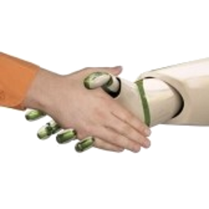
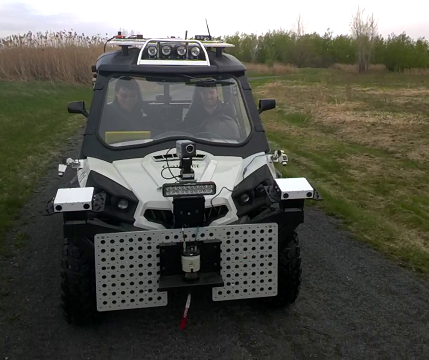
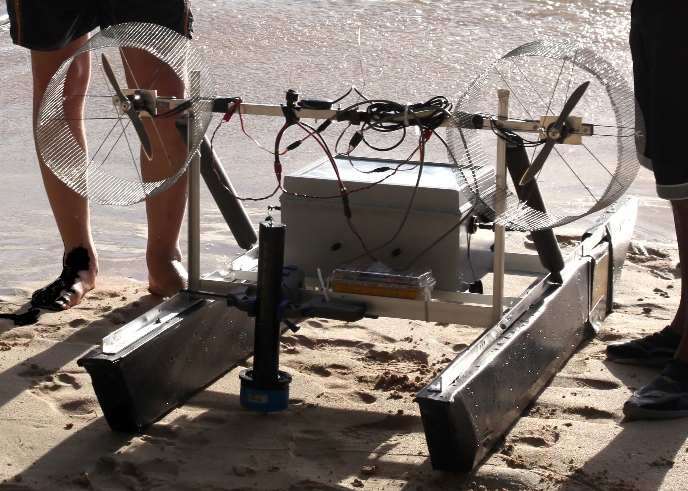
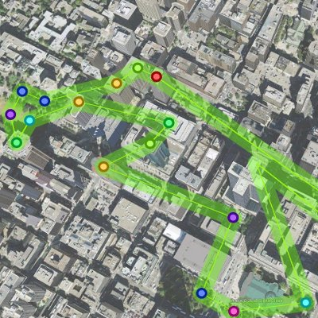
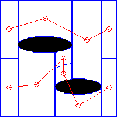
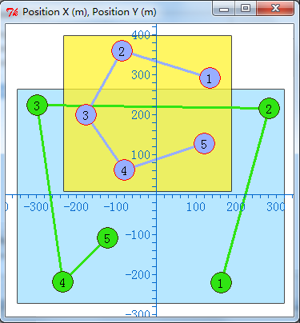
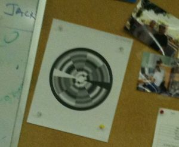
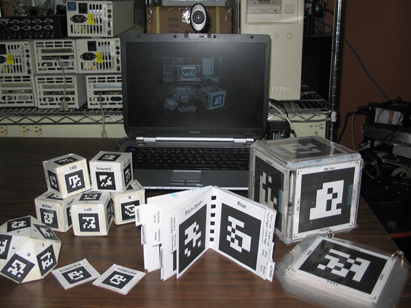

# Research & Publications

Below is a selection of my research projects.
These may be outdated.
Please see my Google Scholar page (in sidebar/header) for a comprehensive and up-to-date list of my publications.

## Trust-Driven Human-Robot Collaboration

|  | *Collaborator(s): [Gregory Dudek](http://www.cim.mcgill.ca/~dudek/)* |

We are interested in optimizing both the task performance and efficiency of interaction in a human-robot system.
To achieve these objectives, we are developing a computational model that characterizes a human operator's degree of trust in an autonomous robotic system.
This quantitative measure shares properties with analogous concepts of trust among humans in sociology and psychology.
Given the need to build trust within the human-robot team, we are also investigating trust-seeking adaptive strategies for increasing the team's efficiency, in terms of the robot's task performance and the human's workload and satisfaction.

A. Xu and G. Dudek: **Maintaining Efficient Collaboration with Trust-Seeking Robots**, in *Proceedings of the IEEE/RSJ International Conference on Intelligent Robots and Systems (IROS '16) **(finalist for IROS KROS Best Paper Award on Cognitive Robotics)***, pages 3312–3319, South Korea, October 2016.

[Abstract](http://www.cim.mcgill.ca/~mrl/pubs/anqixu/iros2016_tactic.txt) | [Bibtex](http://www.cim.mcgill.ca/~mrl/pubs/anqixu/iros2016_tactic.bib) | [PDF](http://www.cim.mcgill.ca/~mrl/pubs/anqixu/iros2016_tactic.pdf)

A. Xu and G. Dudek: **Towards Efficient Collaborations with Trust-Seeking Adaptive Robots**, in the *10th ACM/IEEE International Conference on Human-Robot Interaction Extended Abstract / the 10th Human-Robot Interaction Pioneers Workshop (HRI Pioneers '15)*, pages 221–222, USA, March 2015.

[Abstract](http://www.cim.mcgill.ca/~mrl/pubs/anqixu/hri2015_pioneers_trust_seeking_robots.txt) | [Bibtex](http://www.cim.mcgill.ca/~mrl/pubs/anqixu/hri2015_pioneers_trust_seeking_robots.bib) | [Preprint PDF](http://www.cim.mcgill.ca/~mrl/pubs/anqixu/hri2015_pioneers_trust_seeking_robots.pdf) | [ACM DOI](http://dx.doi.org/10.1145/2701973.2702711)

A. Xu and G. Dudek: **OPTIMo: Online Probabilistic Trust Inference Model for Asymmetric Human-Robot Collaborations**, in the *10th ACM/IEEE International Conference on Human-Robot Interaction (HRI '15)*, pages 221–228, USA, March 2015.

[Abstract](http://www.cim.mcgill.ca/~mrl/pubs/anqixu/hri2015_trust_pgm.txt) | [Bibtex](http://www.cim.mcgill.ca/~mrl/pubs/anqixu/hri2015_trust_pgm.bib) | [Preprint PDF](http://www.cim.mcgill.ca/~mrl/pubs/anqixu/hri2015_trust_pgm.preprint.pdf) | [ACM DOI](http://dx.doi.org/10.1145/2696454.2696492) | [Full-Length User Study Video (1GB Theora)](http://www.cim.mcgill.ca/~anqixu/videos/optimo_user_study.ogv)

A. Xu and G. Dudek: **Towards Modeling Real-Time Trust in Asymmetric Human-Robot Collaborations**, in the *16th International Symposium on Robotics Research (ISRR '13)*, Singapore, December 2013.

[Abstract](http://www.cim.mcgill.ca/~mrl/pubs/anqixu/isrr2013_trust_study.txt) | [Bibtex](http://www.cim.mcgill.ca/~mrl/pubs/anqixu/isrr2013_trust_study.bib) | [PDF](http://www.cim.mcgill.ca/~mrl/pubs/anqixu/isrr2013_trust_study.pdf)

A. Xu and G. Dudek: **Trust-Driven Interactive Visual Navigation for Autonomous Robots**, in *Proceedings of the 2012 IEEE International Conference on Robotics and Automation (ICRA '12)*, pages 3922–3929, St. Paul, USA, May 2012.

[Abstract](http://www.cim.mcgill.ca/~mrl/pubs/anqixu/icra2012_trust.txt) | [Bibtex](http://www.cim.mcgill.ca/~mrl/pubs/anqixu/icra2012_trust.bib) | [PDF](http://www.cim.mcgill.ca/~mrl/pubs/anqixu/icra2012_trust.pdf)

## Interactive Autonomy for Visual Navigation

|  | *Collaborator(s): [Arnold Kalmbach](mailto:akalmbach@cim.mcgill.ca), [Dave Meger](https://www.cim.mcgill.ca/~dmeger/), [Qiwen Zhang](mailto:qzhang32@cim.mcgill.ca), [Gregory Dudek](http://www.cim.mcgill.ca/~dudek/)* |

As robots become more intelligent and autonomous, a critical emerging research topic is how humans can interact and command these robots.
Towards this end, we are developing efficient human-robot interaction methodologies, as well as learning algorithms targeting different levels of specificity within the robot's autonomous system.
A primary application domain for this research is vision-based robot navigation, for which complicated robot sensing and control algorithms can benefit a lot from the keen instincts of human visual system.

A. Xu, Q. Zhang, D. Meger, and G. Dudek: **Interactive Autonomous Driving through Adaptation from Participation**, in *Proceedings of the 10th International Conference on Intelligent Unmanned Systems (ICIUS '14)*, Montreal, Canada, September 2014.

[Abstract](http://www.cim.mcgill.ca/~mrl/pubs/anqixu/icius2014_apexcommander.txt) | [Bibtex](http://www.cim.mcgill.ca/~mrl/pubs/anqixu/icius2014_apexcommander.bib) | [PDF](http://www.cim.mcgill.ca/~mrl/pubs/anqixu/icius2014_apexcommander.pdf) | [Videos](http://bit.ly/ICIUS2014AFP)

A. Xu, A. Kalmbach, and G. Dudek: **Adaptive Parameter EXploration (APEX): Adaptation of Robot Autonomy from Human Participation**, in *Proceedings of the IEEE International Conference on Robotics and Automation (ICRA '14)*, pages 3315–3322, Hong Kong, China, May 2014.

[Abstract](http://www.cim.mcgill.ca/~mrl/pubs/anqixu/icra2014_apex.txt) | [Bibtex](http://www.cim.mcgill.ca/~mrl/pubs/anqixu/icra2014_apex.bib) | [PDF](http://www.cim.mcgill.ca/~mrl/pubs/anqixu/icra2014_apex.pdf) | [Video](http://bit.ly/ICRA2014APEX)

A. Xu and G. Dudek: **A Vision-Based Boundary Following Framework for Aerial Vehicles**, in *Proceedings of the 2010 IEEE/RSJ International Conference on Intelligent Robots and Systems (IROS '10)*, pages 81–86, Taipei, Taiwan, October 2010.

[Abstract](http://www.cim.mcgill.ca/~mrl/pubs/anqixu/iros2010_uav.txt) | [Bibtex](http://www.cim.mcgill.ca/~mrl/pubs/anqixu/iros2010_uav.bib) | [PDF](http://www.cim.mcgill.ca/~mrl/pubs/anqixu/iros2010_uav.pdf) | [Video](http://www.cim.mcgill.ca/~mrl/pubs/anqixu/iros2010_uav.mp4)

See also: **Trust-Driven Interactive Visual Navigation for Autonomous Robots**

## Heterogeneous Multi-Robot Field Applications

|  | *Collaborator(s): [Florian Shkurti](http://www.cs.toronto.edu/~florian/), [Malika Meghjani](http://www.cim.mcgill.ca/~malika/), [Yogesh Girdhar](http://cim.mcgill.ca/~yogesh/), [Juan Camilo Gamboa Higuera](http://www.cim.mcgill.ca/~gamboa/), [Bir Bikram Dey](http://www.cim.mcgill.ca/~birbikram/), [Ioannis Rekleitis](https://cse.sc.edu/~yiannisr/), [Gregory Dudek](http://www.cim.mcgill.ca/~dudek/)* |

We are actively developing infrastructure for heterogeneous multi-robot systems targeting a variety of different field applications, such as the inspection of coral reefs and shallow seabeds.
This project is the culmination and embodiment of a large number of projects involving robot hardware design, embedded computing, robot programming interfaces, and vision-based autonomous robot navigation controllers.

F. Shkurti, A. Xu, M. Meghjani, J. Gamboa, Y. Girdhar, P. Giguere, B. Dey, J. Li, A. Kalmbach, C. Prahacs, K. Turgeon, I. Rekleitis, and G. Dudek: **Multi-Domain Monitoring of Marine Environments using a Heterogeneous Robot Team**, in *Proceedings of the 2012 IEEE/RSJ International Conference on Intelligent Robots and Systems (IROS '12)*, pages 1747–1753, Vilamoura, Portugal, October 2012.

[Abstract](http://www.cim.mcgill.ca/~mrl/pubs/florian/iros2012.txt) | [Bibtex](http://www.cim.mcgill.ca/~mrl/pubs/florian/iros2012.bib) | [PDF](http://www.cim.mcgill.ca/~mrl/pubs/florian/iros2012.pdf) | [Video](http://www.cim.mcgill.ca/~anqixu/pub/iros2012.mp4)

Y. Girdhar, A. Xu, F. Shkurti, J. Gamboa, M. Meghjani, P. Giguere, I. Rekleitis, G. Dudek: **Monitoring Marine Environments using a Team of Heterogeneous Robots**, in *RSS 2012 Workshop on Robotics for Environmental Monitoring (WREM '12)*, Sydney, Australia, July 2012.

[Bibtex](http://www.cim.mcgill.ca/~yogesh/publications/wrem2012.bib) | [PDF](http://www.cim.mcgill.ca/~yogesh/publications/wrem2012.pdf)

Y. Girdhar, A. Xu, B. Dey, M. Meghjani, F. Shkurti, I. Rekleitis, and G. Dudek: **MARE: Marine Autonomous Robotic Explorer**, in *Proceedings of the 2011 IEEE/RSJ International Conference on Intelligent Robots and Systems (IROS '11)*, pages 5048–5053, San Francisco, USA, September 2011.

[Abstract](http://www.cim.mcgill.ca/~mrl/pubs/anqixu/iros2011_boat.txt) | [Bibtex](http://www.cim.mcgill.ca/~mrl/pubs/anqixu/iros2011_boat.bib) | [PDF](http://www.cim.mcgill.ca/~mrl/pubs/anqixu/iros2011_boat.pdf) | [Video](http://www.cim.mcgill.ca/~mrl/pubs/anqixu/iros2011_boat.mp4)

## Social Tele-Robotics

|  | *Collaborator(s): [Juan Camilo Gamboa Higuera](http://www.cim.mcgill.ca/~gamboa/), [Florian Shkurti](http://www.cs.toronto.edu/~florian/), [Gregory Dudek](http://www.cim.mcgill.ca/~dudek/)* |

This project investigates the family of problems where multiple users issue commands to one or more robots.
Since users may be operating under distinct objectives, one novelty lies in relaying commands from multiple users to the robot(s) in an efficient and/or fair manner.
In particular, we have proposed an approximative path planning algorithm with parameterized control over the degree of "social fairness" in the selection of waypoints generated from different users.

J. Gamboa, A. Xu, F. Shkurti, and G. Dudek: **Socially-Driven Collective Path Planning for Robot Missions**, in *Proceedings of the 2012 Ninth Conference on Computer and Robot Vision (CRV '12)*, pages 417–424, Toronto, Canada, May 2012.

[Abstract](http://www.cim.mcgill.ca/~mrl/pubs/anqixu/crv2012_social_plan.txt) | [Bibtex](http://www.cim.mcgill.ca/~mrl/pubs/anqixu/crv2012_social_plan.bib) | [PDF](http://www.cim.mcgill.ca/~mrl/pubs/anqixu/crv2012_social_plan.pdf)

## Efficient Terrain Coverage for Unmanned Aerial Vehicle

|  | *Collaborator(s): [Ioannis Rekleitis](https://cse.sc.edu/~yiannisr/), [Patrick Virie (Chatavut Viriyasuthee)](mailto:pvirie@cim.mcgill.ca)* |

This project investigates approaches for generating coverage patterns (via waypoints) of environments with obstacles, using a topological representation of the world.
We apply an existing theoretical algorithm that guarantees complete and optimal terrain coverage to non-holonomic fixed wing aircrafts, and investigate methods for addressing practical concerns including vehicular dynamics and external factors such as wind.

A. Xu, C. Viriyasuthee, and I. Rekleitis: **Efficient Complete Coverage of a Known Arbitrary Environment with Applications to Aerial Operations**, *Autonomous Robots*, 2013, DOI: 10.1007/s10514-013-9364-x.

[Abstract](http://www.cim.mcgill.ca/~mrl/pubs/anqixu/ar2013_optcov.txt) | [Bibtex](http://www.cim.mcgill.ca/~mrl/pubs/anqixu/ar2013_optcov.bib) | [PDF](http://www.cim.mcgill.ca/~mrl/pubs/anqixu/ar2013_optcov.pdf)

A. Xu, C. Viriyasuthee, and I. Rekleitis: **Optimal Complete Terrain Coverage using an Unmanned Aerial Vehicle**, in *Proceedings of the 2011 IEEE International Conference on Robotics and Automation (ICRA '11)*, pages 2513–2519, Shanghai, China, May 2011.

[Abstract](http://www.cim.mcgill.ca/~mrl/pubs/anqixu/icra2011_optcov.txt) | [Bibtex](http://www.cim.mcgill.ca/~mrl/pubs/anqixu/icra2011_optcov.bib) | [PDF](http://www.cim.mcgill.ca/~mrl/pubs/anqixu/icra2011_optcov.pdf) | [Video](http://www.cim.mcgill.ca/~mrl/pubs/anqixu/icra2011_optcov.mp4)

## Graphical State-Space Programming

|  | *Collaborator(s): [Gregory Dudek](http://www.cim.mcgill.ca/~dudek/), [Jimmy Li](http://www.cim.mcgill.ca/~jimmyli/), [Junaed Sattar](https://junaedsattar.cs.umn.edu/), [Gabriel Charette](mailto:gchare@cim.mcgill.ca)* |

We are developing an interface for controlling mobile robots that combines aspects of graphical trajectory specification and state-space programming.
Our objective is to facilitate the programming and debugging of robot execution plans, containing both scheduled trajectories and activities, as well as contingency plans and failsafe behaviors.

J. Li, A. Xu, and G. Dudek: **Graphical State Space Programming: A Visual Programming Paradigm for Robot Task Specification**, in *Proceedings of the 2011 IEEE International Conference on Robotics and Automation (ICRA '11)*, pages 4846–4853, Shanghai, China, May 2011.

[Abstract](http://www.cim.mcgill.ca/~mrl/pubs/anqixu/icra2011_gssp.txt) | [Bibtex](http://www.cim.mcgill.ca/~mrl/pubs/anqixu/icra2011_gssp.bib) | [PDF](http://www.cim.mcgill.ca/~mrl/pubs/anqixu/icra2011_gssp.pdf) | [Video](http://www.cim.mcgill.ca/~mrl/pubs/anqixu/icra2011_gssp.mpg)

J. Sattar, A. Xu, G. Dudek, and G. Charette: **Graphical State-Space Programmability as a Natural Interface for Robotic Control**, in *Proceedings of the 2010 IEEE International Conference on Robotics and Automation (ICRA '10)*, pages 4609–4614, Anchorage, Alaska, USA, May 2010.

[Abstract](http://www.cim.mcgill.ca/~mrl/pubs/anqixu/icra2010_gssp.txt) | [Bibtex](http://www.cim.mcgill.ca/~mrl/pubs/anqixu/icra2010_gssp.bib) | [PDF](http://www.cim.mcgill.ca/~mrl/pubs/anqixu/icra2010_gssp.pdf)

## Fourier Tag: Gracefully Degradable Fiducial Markers

|  | *Collaborator(s): [David Cortes](mailto:davidcp@cim.mcgill.ca), [Junaed Sattar](https://junaedsattar.cs.umn.edu/), [Gregory Dudek](http://www.cim.mcgill.ca/~dudek/)* |

We are developing a visual fiducial marker system, akin to barcodes, to embed information and provide controllable positioning.
By encoding the payload data within the frequency domain of the respective visual symbol, our system is capable of extracting part of the payload even when the marker is viewed from afar or when it is out of focus.

A. Xu and G. Dudek: **Fourier Tag: A Smoothly Degradable Fiducial Marker System with Configurable Payload Capacity**, in *Proceedings of the Eighth Canadian Conference on Computer and Robot Vision (CRV '11)*, pages 40–47, St. John's, Newfoundland, Canada, May 2011.

[Abstract](http://www.cim.mcgill.ca/~mrl/pubs/anqixu/crv2011_ftag.txt) | [Bibtex](http://www.cim.mcgill.ca/~mrl/pubs/anqixu/crv2011_ftag.bib) | [PDF](http://www.cim.mcgill.ca/~mrl/pubs/anqixu/crv2011_ftag.pdf)

## RoboChat & RoboChat Gestures

|  | *Collaborator(s): [Junaed Sattar](https://junaedsattar.cs.umn.edu/), [Gregory Dudek](http://www.cim.mcgill.ca/~dudek/)* |

We are investigating methods of direct communication between a diver and an underwater robot, by showing fiducial markers to the vehicle.
We have developed a pseudo programming language constructed by showing the robot a sequence of markers, and we are also interested in gestural interaction as a method of implicitly conveying auxiliary information to the robot.

A. Xu, G. Dudek, and J. Sattar: **A Natural Gesture Interface for Operating Robotic Systems**, in *Proceedings of the 2008 IEEE International Conference on Robotics and Automation (ICRA '08)*, pages 3557–3563, Pasadena, California, USA, May 2008.

[Abstract](http://www.cim.mcgill.ca/~mrl/pubs/anqixu/icra2008_gesture.txt) | [Bibtex](http://www.cim.mcgill.ca/~mrl/pubs/anqixu/icra2008_gesture.bib) | [PDF](http://www.cim.mcgill.ca/~mrl/pubs/anqixu/icra2008_gesture.pdf)

G. Dudek, J. Sattar, and A. Xu: **A Visual Language for Robot Control and Programming: A Human-Interface Study**, in *Proceedings of the 2007 IEEE International Conference on Robotics and Automation (ICRA '07)*, pages 2507–2513, Roma, Lazio, Italy, April 2007.

[Abstract](http://www.cim.mcgill.ca/~mrl/pubs/anqixu/icra2007_robochat.txt) | [Bibtex](http://www.cim.mcgill.ca/~mrl/pubs/anqixu/icra2007_robochat.bib) | [PDF](http://www.cim.mcgill.ca/~mrl/pubs/anqixu/icra2007_robochat.pdf)

## Collaborations

I am extremely proud to have contributed to a number of collaborative projects along with numerous colleagues.

D. Meger, J. C. Gamboa Higuera, A. Xu, P. Giguere, G. Dudek: **Learning Legged Swimming Gaits from Experience**, in *Proceedings of the 2015 IEEE International Conference on Robotics and Automation (ICRA '15) **(finalist for Best Conference Paper Award)***, pages 2332–2338, Seattle, Washington, USA, May 2015.

[Project Page](http://www.cim.mcgill.ca/~dmeger/ICRA2015_GaitLearning/) | [Abstract](http://www.cim.mcgill.ca/~mrl/pubs/anqixu/icra2015_gait_learning.txt) | [Bibtex](http://www.cim.mcgill.ca/~mrl/pubs/anqixu/icra2015_gait_learning.bib) | [PDF](http://www.cim.mcgill.ca/~mrl/pubs/anqixu/icra2015_gait_learning.pdf)

M. Doniec, A. Xu, D. Rus: **Robust Real-Time High Definition Underwater Video Streaming with AquaOptical II**, in *Proceedings of the 2013 IEEE International Conference on Robotics and Automation (ICRA '13)*, pages 5117 — 5124, Karlsruhe, Germany, May 2013.

[Abstract](http://www.cim.mcgill.ca/~mrl/pubs/anqixu/icra2013_aquaoptical.txt) | [Bibtex](http://www.cim.mcgill.ca/~mrl/pubs/anqixu/icra2013_aquaoptical.bib) | [PDF](http://www.cim.mcgill.ca/~mrl/pubs/anqixu/icra2013_aquaoptical.pdf)
