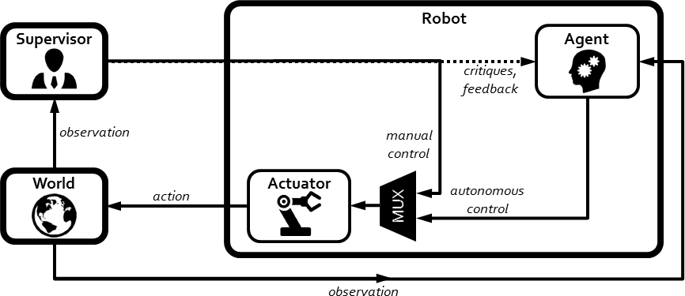
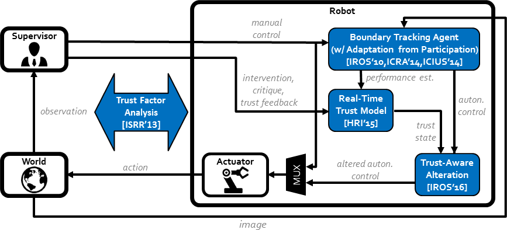
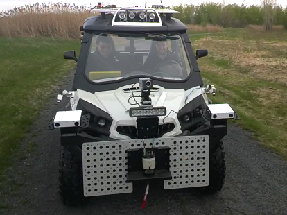

# Thesis

My Ph.D. research enables mobile robot agents (e.g. self-driving cars, aerial drons, marine robots, etc.) to *quantify* and *capitalize* the innate human affect of **trust**, toward establishing and actively maintaining efficient collaboration with humans.

*My research targets human-robot teams adhering to a supervisor-worker style relationship, where the human’s main duty is to supervise an autonomous robot agent that works on given tasks, and also sometimes intervene at the control level to help out.*

*The four main contributions of my thesis comprise of a fluid interaction paradigm (Adaptation from Participation — AfP), a set of empirical analyses into human-robot trust, a real-time trust inference engine (Online Probabilistic Trust Inference Model — OPTIMo), and a general strategy for mobile robot agents to seek to regain lost trust (Trust-Aware Conservative Control — TACtiC).*

*I have deployed and evaluated trust-seeking robot agents on aerial drones, swimming robots, autonomous vessels, wheeled robots, and even this autonomous SL-Commander all-terrain vehicle at the Canadian Space Agency (CSA).*

## Download

* [minified PDF (8MB)](content/thesis/thesis.min.pdf)
* [prettified PDF with links (26MB)](content/thesis/thesis.pdf)